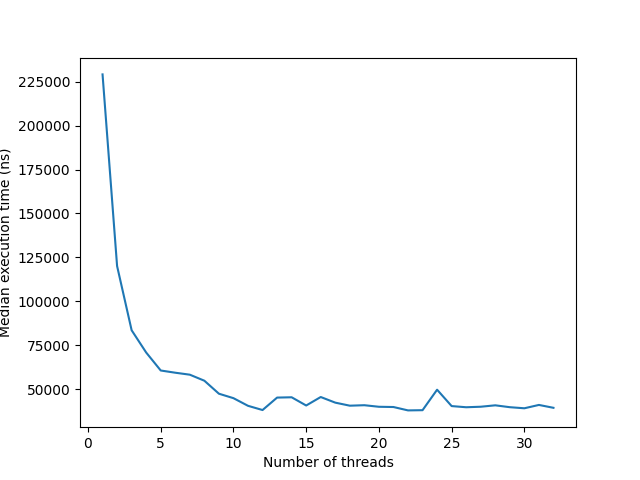

# Integral calculator

Implementation of threaded integral calculation of the de-jong function in defined limits 

## Running

Provide configuration file as an application parameter

    cmake-build-debug/ThreadedIntegral config.txt

Make sure that you are running application from correct directory and path 
resolves correctly or provide an absolute path

### Configuration file structure:

Here is an example content of config file. Please, reuse it, replacing required values

    0.0001      // expected precision
    0.0000001   // expected relative precision
    1           // number of threads to run
    -50         // X1 integration interval
    50          // X1 integration interval
    -50         // X2 integration interval
    50          // X2 integration interval
    10          // max iterations

### Output

Program outputs four values: calculated result, absolute and relative precisions and total execution time:

    4545447.65291
    0.00372078921646
    8.18574868874e-10
    238011
    
## Testing

To run unittests:

    python3 test.py
    
## Performance

